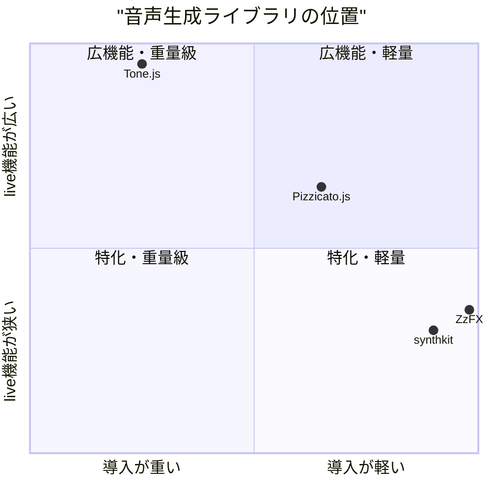
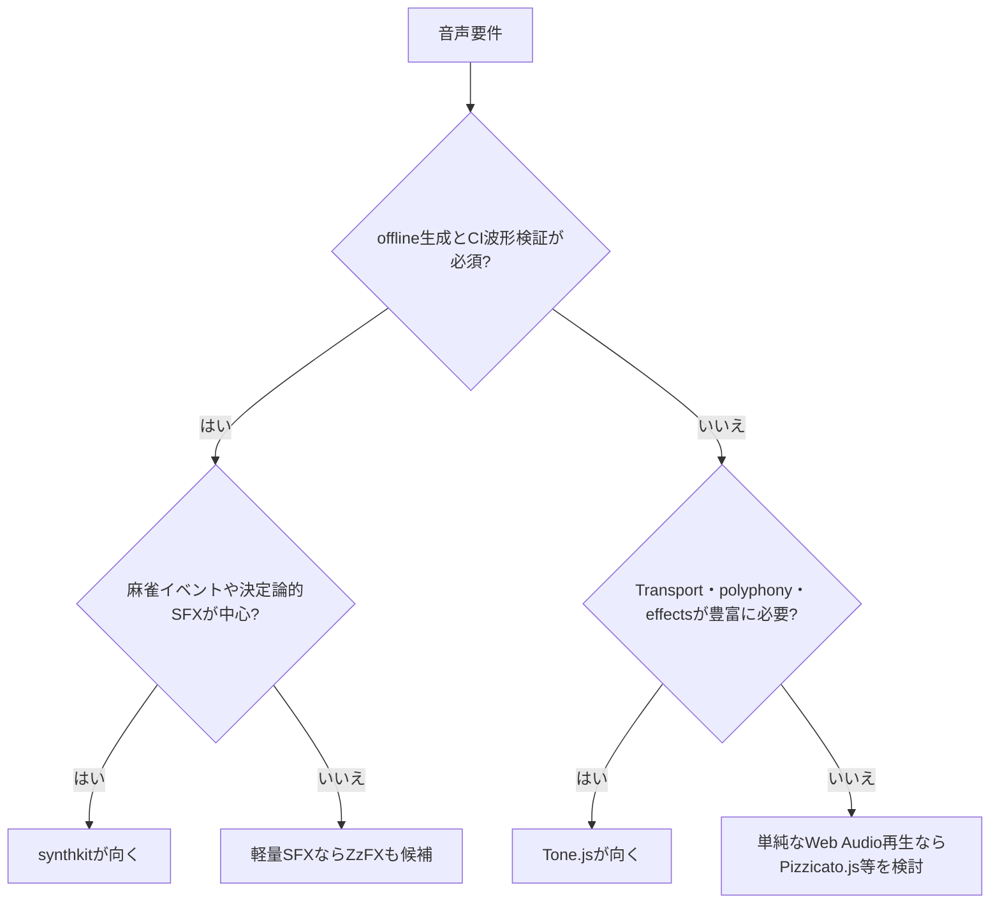

# 市場調査: synthkit

## 0. 要約

立ち位置: ゲーム向けの小さな手続き音声エンジンで、同じspecをオフライン検証と将来のWeb Audioへ使える点が特徴。
最大の弱点: 現状はM1で、sequencer・filter・live connect・SFX presetが未実装なので、ゲーム音声の仕事全体はまだ完結しない。
次の一手: M2のsequencer/filterを「決定論的なFloat32Array生成」として仕上げ、M3の麻雀SFX presetを実例とテストで差別化する。

## 1. このrepoは何か

一言でいうと、plain-dataのsynth specから決定論的に音声を生成する、ゲーム組み込み用のJavaScript音声生成エンジンである。README・設計書・実装を確認した範囲では、M1の実体は `render(spec, opts)` と `note(name)` であり、sine/saw/square/triangle/noise、ADSR、seed付きnoiseを扱う。`render`はAudioContextやDOMを必要とせず、monoの `Float32Array` を返す。

提供価値は「音声ファイルを作って再生する」ことではなく、ゲーム状態から同じ入力なら同じSFX/BGM素材を生成し、それをNodeのheadless CIで波形・RMS・周波数・クリッピングまで検査できることにある。実際の利用単位はsynthkit単体の音楽制作環境ではなく、ゲーム本体（READMEではnetmahgとの統合を想定）＋このエンジン＋テストの組み合わせである。比較対象は、同じくJavaScriptから音を生成・制御するライブラリとした。

想定利用者は、Webゲームの開発者と、音声アセットを増やさずにイベント音・動的BGMをコードから作りたい開発者である。現時点の客観指標は、公開API 2個（`note`、`render`）、runtime dependencies 0個、`index.js` 151行・7,334 bytes、テスト17件pass（2026-07-31実行）である。公開npm版は `0.1.0`、repoのREADME上の到達点はM1である。

## 1.5 調査の型

`engine` と判定した。作品や完成音源を比較するのではなく、ライブラリとしてAPI設計を比較する。主軸は、入力が宣言的か、状態と再現性をどう扱うか、offline/liveの境界、拡張点、導入の軽さである。音の「面白さ」や音質の優劣は、同一条件の聴感試験をしていないため主張しない。

## 2. 比較対象と選定理由

| 製品 | 何ができるか | 採用状況 | ライセンス | うちとの決定的な違い | なぜ選んだか |
|---|---|---|---|---|---|
| Tone.js | Web Audio上のシンセ、エフェクト、サンプラー、Transport、sample-accurate scheduling、poly synth | ★14.7k / 最終commit 2026-07-04（参照日 2026-07-31） | MIT | ブラウザliveと音楽スケジューリングが中心。runtime依存あり。 | 同カテゴリの最大級の標準例で、API設計の上限を知るため |
| ZzFX | 20パラメータの小型SFX生成、サンプル生成・再生、WAV保存、ZzFXMによる音楽 | ★755 / 最終更新日はGitHub公開画面で確認できず（参照日 2026-07-31） | MIT | 極小の命令的パラメータ配列と即時再生が中心。決定論性は保証されない。 | ゲームSFXという用途が近く、サイズと入力手間の下限を示すため |
| Pizzicato.js | 波形・ファイル・マイク・関数から音を作り、再生・グループ化・多数のエフェクトを扱う | ★1.7k / 最終更新日はGitHub公開画面で確認できず（参照日 2026-07-31） | MIT | Web Audioを簡単に使うliveライブラリ。README自身がdeprecatedと記載。 | Tone.jsより軽いWeb Audio抽象化の先行例で、導入・保守の対比に使えるため |

採用状況はTone.jsへの集中と、用途特化の小規模OSSへの分散が同居している。つまり「ブラウザで音を鳴らす」だけなら既製品が十分にあり、一般目的の機能追加では勝ちにくい。一方、ZzFXの極小性とTone.jsの豊富さの間に、決定論的なoffline生成を主役にしたゲーム向けの空間は残っていると読める。Pizzicato.jsは機能の参考にはなるが、deprecatedという明示的な注意があり、採用候補としては慎重に扱うべきである。

## 3. ポジショニング

この図は、公開README・package.json・実装から読める「導入の軽さ」と「live音楽機能の広さ」を定性的に置いたもの。座標は計測値ではなく、比較表の機能差からの整理（推測）であるため、採用状況の図とは扱わない。

## 4. 機能比較

| 機能 | 重み | synthkit | Tone.js | ZzFX | Pizzicato.js |
|---|---|---|---|---|---|
| plain-data入力から音を組み立てる | ◎必須 | ○ | △ | △ | △ |
| offline生成を主経路にする | ◎必須 | ○ | △ | ○ | × |
| 同一入力の決定論的再生成 | ◎必須 | ○（seed付きnoise） | × | × | × |
| headless CIで波形を検査できる | ◎必須 | ○ | △ | △ | × |
| oscillator + ADSR | ◎必須 | ○ | ○ | ○ | △ |
| sequencer / tempo scheduling | ○効く | ×（M2予定） | ○ | △（ZzFXM別） | △ |
| filters / effects | ○効く | ×（M2予定） | ○ | ○ | ○ |
| live Web Audio出力 | ○効く | ×（M4予定） | ○ | ○ | ○ |
| polyphony / graph composition | ○効く | ×（M2/M4予定） | ○ | × | △ |
| 音声ファイル不要のSFX | ○効く | ○ | ○ | ○ | △ |
| 依存ゼロ・単一ESM | ◎必須 | ○ | × | ○ | △ |
| 麻雀イベント向けpreset | ◎必須 | ×（M3予定） | × | × | × |

痛い×は、現状のM1ではsequencer・filter・live出力がなく、ゲーム側がBGMや複合SFXを作るところで止まる点である。ただし、これらを全部Tone.js並みに広げる必要はない。差別化になっている○は決定論的offline生成、依存ゼロ、plain-data、headless検証であり、一般的なoscillator/ADSRや「音を鳴らせること」自体は差別化ではない。麻雀presetは既製品にないが、まだ実装前なので現時点の勝ちではなく、これから実証すべき仮説である。

## 4.5 コード・実装の比較

| 観点 | synthkit | Tone.js | ZzFX | Pizzicato.js | 出典 |
|---|---:|---:|---:|---:|---|
| 公開APIの数え方 | 2 export | 多数のclass/module（単一数値にする仕様がない） | `zzfx`、`ZZFX`、`ZZFXSound` | `Pizzicato.Sound`等のオブジェクトAPI | 各repoのindex/README/実装 |
| runtime依存 | 0 | 2（`standardized-audio-context`、`tslib`） | 0 | package.json上は0 | 各package.json |
| テスト | 17 pass | READMEに「nearly 100% coverage」、実行は未実施 | 公開実装にテスト数の記載なし | package.jsonにgulp test、実行は未実施 | README/package.json、2026-07-31 |
| 配布・ソースの小ささ | `index.js` 7,334 bytes / 151行 | TypeScriptの複数ディレクトリ＋build配布 | `ZzFX.js`は5行のminified-style source表示、micro版は1KB未満をREADMEが主張 | 公式サイトがminified+gzip 6KBを表示 | repo実装・公式サイト |
| ライセンス | MIT | MIT | MIT | MIT | 各LICENSE/package.json |

synthkitは、Tone.jsのような抽象化の厚さを持たない代わりに、入力から出力までを一つの純粋な関数として追いやすい。ZzFXはサイズで圧倒的だが、乱数を使う実装であり、synthkitのCI向け再現性とは前提が違う。Pizzicato.jsはlive Web Audioの便利さを優先する。なお、比較コードはTone.jsのpackage.json・API/ソース構成、ZzFXの生成実装まで確認したが、Pizzicato.jsのソース本文は取得キャッシュの制約で読めなかった。そのためコード比較のconfidenceは「中」とする。

## 5. 採用状況

正確な比較値を取得できたGitHub starは以下の通り（2026-07-31参照）。synthkit自身の公開GitHubページは取得できず、star数は不明なので、synthkitを含む棒グラフは作らない。

| 製品 | GitHub star |
|---|---:|
| Tone.js | 14,700 |
| Pizzicato.js | 1,700 |
| ZzFX | 755 |
| synthkit | 不明 |

starの差は、機能の優劣そのものではなく、既存コミュニティ・知名度・用途の広さを含む採用の proxy と読むべきである。Tone.jsと正面から規模を競うのは合理的でない。synthkitは、starを増やす前に「なぜ既存のWeb Audioライブラリではなくこれを使うのか」を、再現可能なテストと小さなゲーム統合例で示す必要がある。

## 5.5 調査者の見立て

本当の勝負所は、oscillatorの種類ではなく「ゲーム状態→plain spec→同じFloat32Array」という検証可能な境界だと思う。そこが成立すれば、音の聴感を毎回人手で確認しなくても、SFXの回帰テストをゲームコードと同じCIに置ける。

数字に出ていない懸念は、現在のREADMEが将来計画を大きく掲げる一方、M1の実装しかないことだ。Tone.jsは活発なcommit履歴と広いテスト体系を持ち、Pizzicato.jsはdeprecatedを明示しているので、synthkitも「計画」ではなく各milestoneの完了条件を外部から確認できる形にする必要がある。

私なら、まずM2を実装し、`sequence` と filter を「純粋なoffline API」として完成させる。その後M3で麻雀SFXを5種類程度、パラメータとスペクトル・エンベロープのテスト付きで出し、M4のlive backendはoffline仕様に従う薄いadapterにする。

この見立てが外れる条件は、実際のゲーム側が決定論的offline生成を必要とせず、ブラウザでの即時再生・Transport・エフェクト編集を最優先する場合である。その場合はTone.jsを薄く使う方が合理的で、synthkitの最大差別化は採用理由にならない。

## 6. 提案（優先順）

| 順 | 提案 | 分類 | 根拠 | 最小の一手 | 効きそうな指標 |
|---:|---|---|---|---|---|
| 1 | M2の `sequence` と低域/高域filterをoffline純粋関数として実装する | 埋める | 4節の◎/○で現状×。M1の決定論性を保ったまま用途を広げられる | ノート列・gate・durationの最小schemaを固定し、per-step周波数テストを追加 | BGM/SFXの複数イベントをAudioContextなしで生成できる割合 |
| 2 | 麻雀向けSFX presetを実装し、音ではなく測定可能な契約を公開する | 伸ばす | 比較対象にドメインpresetがなく、READMEのM3計画と直結 | clack / riichi / tsumo / ron / doraFlipを各1関数、intensity・pitch・seedを受ける | preset数、seed再現率、peak/RMS/スペクトルのCI pass |
| 3 | `render`と将来の`connect`が同じspecを受ける契約を先に固定する | 伸ばす | Tone.jsはliveが強い。synthkitはofflineをsource of truthにできる | spec schemaと、live実装時に満たすべきテスト表をdocsに固定 | offline/liveで同一specを受ける機能率 |
| 4 | 1ページの比較可能なゲーム統合例を追加する | 埋める | 機能差だけでは採用理由が伝わらず、repo単体の価値が抽象的 | game state 3種からspecを作り、CIでWAV/指標を確認する例 | 初回導入行数、サンプル実行時間、再現可能なfixture数 |
| 5 | Tone.js相当のTransport・Sampler・大量effectを自前実装する | やらない | 最大競合の強みを追うと依存・API面・保守負担が増え、offline決定論の差別化が薄れる | 既存機能の境界をREADMEに明記し、必要時はTone.jsとの併用を案内する | 保持するruntime依存0、M1/M2のAPI安定性 |

## 7. 選択の分岐

## 8. 出典

| URL | 参照日 | 何の根拠に使ったか |
|---|---|---|
| [synthkit README](https://github.com/opaopa6969/synthkit/blob/3e35e91886454418bdcdb397f483fccbb204cbb0/README.md) | 2026-07-31 | repoの目的、M1状態、API、テスト結果の説明 |
| [synthkit index.js](https://github.com/opaopa6969/synthkit/blob/3e35e91886454418bdcdb397f483fccbb204cbb0/index.js) | 2026-07-31 | 実装、公開export、決定論的PRNG、未実装milestone |
| [synthkit test.mjs](https://github.com/opaopa6969/synthkit/blob/3e35e91886454418bdcdb397f483fccbb204cbb0/test.mjs) | 2026-07-31 | 17件pass、RMS/peak/周波数/決定論性の検査 |
| [Tone.js repository](https://github.com/Tonejs/Tone.js) | 2026-07-31 | 14.7k stars、MIT、機能、最終commit 2026-07-04、テスト方針 |
| [Tone.js package.json](https://raw.githubusercontent.com/Tonejs/Tone.js/dev/package.json) | 2026-07-31 | version 15.5.30、runtime依存2、dev/test scripts、MIT |
| [Tone.js README/API](https://github.com/Tonejs/Tone.js/blob/dev/README.md) | 2026-07-31 | Synth/ADSR、Transport、polyphony、effects、Sampler、AudioContext |
| [Tone.js source tree](https://github.com/Tonejs/Tone.js/tree/dev/Tone) | 2026-07-31 | component/core/effect/event/instrument/signal/sourceの構成とtestファイル |
| [Tone.js commit history](https://github.com/Tonejs/Tone.js/commits/dev) | 2026-07-31 | 最終commit日 2026-07-04 |
| [ZzFX repository](https://github.com/KilledByAPixel/ZzFX) | 2026-07-31 | 755 stars、MIT、20パラメータ、依存なし、micro版1KB未満、用途 |
| [ZzFX.js implementation](https://raw.githubusercontent.com/KilledByAPixel/ZzFX/master/ZzFX.js) | 2026-07-31 | buildSamples、play、getNote、乱数、API実装の確認 |
| [Pizzicato.js repository](https://github.com/alemangui/pizzicato) | 2026-07-31 | 1.7k stars、MIT、223 commits、機能、deprecatedの明記 |
| [Pizzicato.js package.json](https://raw.githubusercontent.com/alemangui/pizzicato/master/package.json) | 2026-07-31 | version 0.6.4、runtime依存の記載なし、test script、MIT |
| [Pizzicato公式サイト](https://alemangui.github.io/pizzicato/) | 2026-07-31 | waveform/file/microphone/function、effects、minified+gzip 6KBの表示 |

GitHub画面でPizzicato.jsとZzFXの最終commit日を確認できなかったため、文書では「不明」とした。Pizzicato.jsのソース本文も取得キャッシュの制約で読めず、推測で埋めていない。starsは将来変わるため、全て参照日とセットで記録した。
